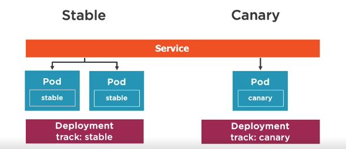
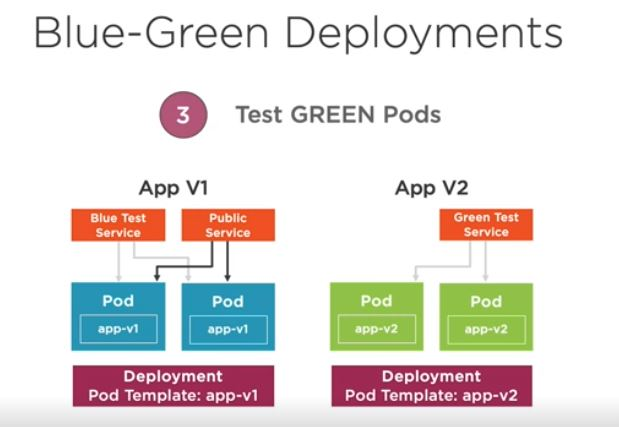

## Kubernetes - Deploying your code - Deployment and deployment stratergy

- one of the main advantage of k8s is zero downtime updates
- K8s deployment options
  - Rolling updates
  - Blue-Green Deployments
  - Canary Deployments
  - Rollbacks

### Rolling update deployments

- rollout- this basically replaces old pods one by one. -- optimal zero downtime update
- recreate - this brings down all old pods and creates new pods-- this is used when you dont wnat partial routing ex:UI the user may see different ui on multiple hits
- Creating initial deployment keeping rollback in mind ` kubeclt apply -f fileName --record `
- check rollout status using ` kubectl rollout status deployment [depName] `
- ` kubectl rollout history deployment [depName] ` 
- ` kubectl rollout undo deployment [depName] --to-revision=2 `

### Canary deployments
- It involves deploying new version of app next to stable production version and route a small amount of requests to check on the latest version before promoting or rejecting the deployment
  - Stratergy is of checking the viability of deployment
  - run 2 indentical prod env at same time
  - latest version is setup to receive minimal traffic
  - 

### Blue-Green Deployment
- You deploy 2 environment one serving customer with stable version the other one for internal testing.
- Once the testing is good the traffic from customer is routed to new one.
- Blue(stable) is called current running deployment and Green(latest) is termed as new version deployment
- 
- Changing from Blue to Green
  - Once a Green deployment is successfully rolled out and tested, change the public service selector to green. -- change the selector in services