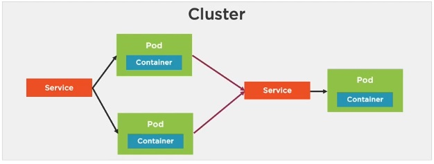
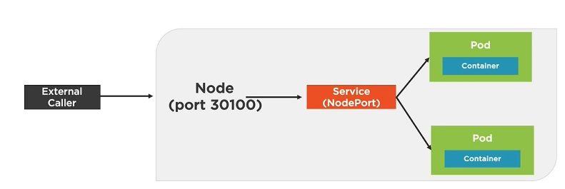
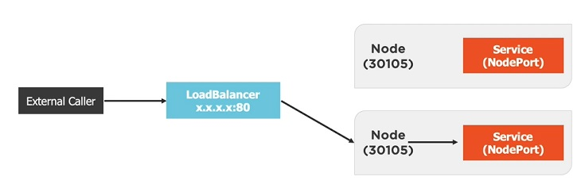
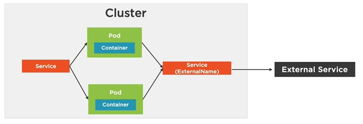
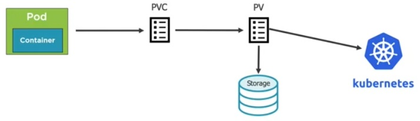

# Kubernetes


## History
- Came out of google
- Written in Go
- Kubernetes is also termed as K8s 
- DNA of borg and omega platform of google used for managing containers

## What & Why
## Architecture
- Big picture view
  - An orchestrator for microservices apps
  - Master- Make decision on which node the work on 
  - Node- do the actual work
- Master -
  - kube-apiserver
    - Front end to control plane
    - Exposes the API
    - Consumes JSON
  - Cluster store
    - Persistent storage
    - Cluster state and config are stored
    - Uses etcd(opensource keyvalue store)
    - etcd store is Distributed , consitent, watchable
  - Controller manager
    - Controller of controllers
    - Node controller
    - endpoints controller
    - Namespace controller
    - Watches for changes
  - Scheduler
    - watches apiserver for new pods
    - Assign work to nodes
      - affinity
      - constraints
      - reosources
- Nodes - kubernetes workers
  - kubelet 
    - main kubernetes agent on node
    - registers node with cluster
    - watches apiserver
    - Instantiates pods
    - Report back to master
    - exposes endpoint on :10255
  - Container Engine
    - does container mangement
    - pulling images
    - starting/stoping containers
    - Pluggable
      - usually docker 
      - can be rkt
  - Kube-proxy
    - kubernetes networking
    - pod IP address
    - all containers in a pod share a single IP
    - Load balances across all pods in a service
- ### Declarative Model and Desired state
  - Kubernetes operates on a Declarative Model
    - We just give a Manifest of how service should look in the form of YAML / JSON
  - This input constitute the desired state
- ### Pod -
  - Containers always run inside of pods
  - Pods can have multiple containers
  - Pod is a Ring-fenced environment
    - has its Network stack
    - kernel namespaces....
  - The unit of scaling in k8s is pod
    - i.e you scale by adding more pods and not running more containers
  - Pods are atomic
    - only 2 state pod is there / pod is not there .. no intermediate state
    - Pod is never registered until is up and running
  - Pod lifecycle
    - pending for work -> running -> succeeded/failed
  - Deploying pod
> Note- Everything pods, service, nodes, masters ... in k8s gets labeled
- ### Services
  - Service is maily meant to bind the pods with the service so that there is load balance between request
  - Like service sits in between pods and other pods
  - It load balances, only send to healthy pods, can be configured for session affinity, can point to things outside cluster, random load balancing, uses tcp by default
  - Pods and services are bound by label i.e pad with same lable are one linked to service with same label service
- ### Deployment


- ## Objects in K8s API's
  - Pods - atomic unit of scheduling
  - Replication Controllers - scale pods , desired state etc
  - Deployments - RC+ rolling updates, rollbacks
  - Service - stable networking.

- ## Installing K8s
  - Minikube - on prem K8s env
  - GKE - Google container Engine
  - AWS provider
  - Manual installation

- ## Working with Pods 
  - Pods contain one or more container
  - You define a pod in mainfest file and submit to apiserver
  - one IP per pod irrespective of containers in it
  - Interpod communication are simple over pod network
    - every pod can communicate with every other pod on same network
  

  - In Hypervisor virtualization - atomic unit is VM , In docker its Container, In case of K8s its pods.
  - You define a pod in manifest file and submit it to apiserver
  - Pods are scheduled on nodes
- > Creating a Pod from yml file
- > `kubectl create -f pod.yml` - creates a deployment as specified in yml
- > `kubectl get pods` - gets all the pods in the container for specific pod  `kubectl get pod/hello-pod`
- > `kubectl describe pods` - describes all the pods similarly `kubectl describe pod/hello-pod`
- > to get all pods including kubes `kubectl get pods --all-namespaces`
- > `kubectl delete pods hello-pod`
- > we usually dont directly work with pod creation - main reason is we have higher level which adds more desired state into system 
  - using replication controller
- > `kubectl create -f rc.yml` - basically the same command to get the Replication controller up adn running
- > In order to update the RC thats running say with 10 replicas to 20 just edit the rc.yml and use cmd `kubectl apply -f rc.yml`
- > get status of RC - `kubectl get rc -o wide`

### Kubernetes services
- The way to expose your application outside world
- Servies are Rest Objects in K8s api
- Request at service load balaces across the pods associated with it
- service gets a single IP,DNS and port and it never change
- when ever you create service you it also creates an endpoint with all pods associated with it and pods are connected to service via lable
- Service Discovery 
  - based on DNS
  - Environment variables
- Services are created in 2 ways
  - Creating Services Iterative way
    - `kubectl expose rc hello-rc --name=hello-svc --target-port=8080 --type=NodePort`
  - Creating Services in Declarative way
    - using yml file 
    - ` kubectl get ep` - fetches the endpoint info
    - ` kubectl describe ep hello-svc`
### Kubernetes deployments

- Deployment is mainly meant for updates and rollbacks...

- `kubectl rollout status deployment hello-deploy` - get the status of deployment
- `kubectl rollout histroy deployment hello-deploy` - get the history of deployments ..but you need to make sure you run `kubectl apply -f deploy.yml --record` the --q
record flag maintains the record
- rolling back - `kubectl rollout undo deployment hello-deploy --to-revision=1`

-----------------------------------------------------------
# Kuberenetes for developers/Core concepts
- Intro
  - Opensource system for automating deployment,scaling and management of containerized application
  - Kubernetes is like a conductor of a container orchestra
    - Key features of K8s
      - service discovery/load balancing
      - storage orchestration
      - automate rollouts/rollback
      - self-healing
      - secret and configuration management
      - horizontal scaling
  - K8s Big picture
  - Why K8s
    - Key container benefits
      - Accelerate Developer on boarding
      - Elimate App conflicts
      - Environment consistency
      - Ship Software faster
    - key k8s benefits
      - Orchestrate Containers
      - Zero-Downtime deployments
      - Self Healing
      - Scale containers
    - Developer Use cases
      - Emulate Production locally
      - Move from docker compose to Kubenetes
      - Create an end to end testing environment
      - Ensure application scales properly
      - Ensure secretes/config are working properly
      - Performance testing scenarios
      - workload scenarios
      - Learn how to leverage deployment options
      - Help DevOps create resources and solve problems
  - ## Kubenetes Pod
    - Pod is the basic foundation of K8s
    - smallest object of k8s object model
    - organize application parts into pods
    - Pod has IP, memory, volumes,etc. shared across containers
    - scale horizontal .
    - pod is never restated it die its gone a new one will be intantiated
    - Container processes need to bind to diff ports within pod
    - ports can be reused by containers in separate pods
    - `kubectl run podname --image=nginx:alpine`
    - `kubectl create -f filename.yml` , `kubectl apply -f filename.yml`
    - Enable pod container to be called externally `kubectl port-forward nameOfPod 8080:80` herer 8080 if host port and 80 is container port
    - delete pod - `kubectl delete pod nameOfPod`
    - delete - `kubectl delete -f fileName.yml`
    - accessing container via interactive shell - `kubectl exec <nameOfPod/container> -it sh`
    - ### Pod health - 
      - kubernetes depends on something called probes to determine the health of pod
      - A probe is a diagnostic that is performed periodically by the kubelet on a container
      - Probe category
        - Liveness probe - determine pod is healthy and running
        - Readiness probe - used to determine if a pod should receive requests
      - Probe types
        - ExecAction - exec a command and detemine health
        - TCPSocketAction - TCP check against the containers IP address on specific port
        - HttpGetAction - HTTP GET request against container
  - ## Deployments
    - Deployments is a declarative way of managing pods using a replicaset.
    - Repicaset is a declarative way to manage pods.
      - It acts as a pod controller
        - self-healing mechanism
        - ensure requested number of pods are available
        - provide fault tolerance
        - can be used to scale pods
        - relies on pod tempate
        - used by deployment
    - Pods can be created/destroyed but never recreated
    - Deployment manges pods 
      - pods are managed using replicaset
      - scales replicaset which scale pods
      - supports zero downtime updates by creating and destroying replicaset
      - provides rollback facility
      - creates a unique label that is assigned to replicaset and generate pod
      - YAML is similar to ReplicaSet
    - POD hirerchy in K8s 
      - 
      - `kubectl get deployments -l app=myapp` - Get deployments with specific label 
      - `kubectl get deployments --show-labels` - shows deployments along with labels
      - `kubectl scale deployment [deployment-name] --replicas=5` - scaling pods horizontally
      - `kubectl scale -f file.deploy.yml --replicas=5`  or you can even add it in your yml file
      - Deployment Options
        - Zero downtime deployment - one of the key strength of K8s
        - the Options
          - Rolling updates (default)
          - Blue-green deployment or( A B deployments) - 
          - Canary deployment - very small amount of traffic move to new deployment and if every thing is good route all the requests
          - Rollbacks
  - ## Services
    - It provides a single point entry for accessing one or more pods
    - Why we need services?
      - Every pod has its own IP adress and they are mortal ... if pod dies/recreated/scheduled the IP address changes making reliability on IP address of pod to connect to it unreliable
      - And on scaling pods also the IP address are known after it has been scheduled.
    - Service abstract Pod IP addresses from consumer
      - How they do it - Labels
      - Relies on labels to associate a service with Pod
    - Load balances between pods 
    - Node's kube-proxy creates a virtual IP for Services
    - Layer 4(TCP/UDP over IP)
    - Services are not short lived they stick around for a long time
    - Creates endpoints which sits between service and pods
    - ### Services Types
      - ClusterIP- Expose the service on a cluster-internal IP
      - NodePort- Expose the service on each Node's IP at static port
      - LoadBalancer- Provision an external IP to act as a load balancer for the service
      - ExternalName- Maps a service to a DNS name
      - ClusterIP - default one 
        - Service IP is exposed internally within cluster
        - Only pods within the cluster can talk to a service 
        - 
      - NodePort Service-
        - Exposes the service on each Node's IP at a static port
        - Allocates a port from a range(default is 30000-32767)
        - Each Node proxies the allocated port 
        - 
      - LoadBalancer Service
        - Exposes a service externally
        - Useful when combined with a cloud provider's load balancer
        - NodePort and ClusterIP services are created
        - 
      - ExternalName Service
        - Service that acts as an alias for an external service
        - Allows a service to act as the proxy for an external service
        - External service details are hidden from cluster
        - 
      - `kubectl port-forward podName hostport:containerport`
      - `kubectl expose rc hello-rc --name=hello-svc --target-port=8080 --type=NodePort`
      - [example-service.yml](/examples/example2/service-ex1.yml)
    - ## Storage
      - Volumes - to store data and state for pods and containers
      - Why volumes?
        - Pods live and die so their file system is short lived
        - Volumes can be used to store state/data and use it in a pod
        - A Pod can have multiple Volumes attached to it
        - containers rely on a mountPath to access a volume
        - Kubernetes supports
          - Volumes
          - Persistent Volumes
          - Persistent Volume Claims
          - StorageClasses
      - Volumes
        -  Similar to docker volume references
         -  emptyDIr - for storing transient data useful for sharing files between containers running in a pod
         -  hostPath - Pod mounts into the Node's fileSystem
         -  nfs- Network File System
         -  configMap/secret - special types of volume that provide a pod with k8s resources
         -  persistentVolumeClaim 
         -  cloud - cluster-wide storage
      - Persistent Volumes and Persistent Volume claim
        - Persitent Volume(PV) is a cluster wide storage unit provisioned by an administrator with a lifecycle independent from the a pod
        - PersistentVolumeClaim is a request for a storage unit.(PV)
      - PV is acluster wide storage that relies on network attached storage(NAS)
      - Normally provisioned by a cluster administrator
      - Available to a pod even if it gets rescheduled to a different Node
      - Rely on a storage provider such as NFS , cloud storage, or other options
      - Associated with a pod by using a PVC
      - 
      > [You can find more examples here](https://github.com/kubernetes/examples) 
      - StorageClasses
        - A type of storage template that can be used to dynamically provision storage
        - SC is used to define diff classes of storage
          - Acts as type of storage template
          - Supports Dynamic provisioning of PV

    - ## ConfigMaps and Secrets
      - ConfigMaps provide a way of storing configuration information required/used by container
      - Provides a way to inject configuration data inro container
      - How inject the configuration
        - Can store entire file(json,xml) or provide as a key-value pair
        - provide on the command-line
        - ConfigManifest
      - How to access it by pods
        - Environmental variable(Key/Value)
        - ConfigMap Volume (access as files)
      - Cmds
        - `kubectl create -f config-map-file`  - this would be config map manifest file  ex:  or
        - `kubectl create configmap [config-map-name] --from-file=[path to file]` - this fill would contain only key value pair
        - `kubectl create configmap [config-map-name] --from-env-file=[path to envfile]` - 
        - `kubectl create configmap [cm-name] --from-literal=key1=value1 --from-literal=key2=value2` - input config directly from cmd line
      - Using configmaps
        - `kubectl get cm [cm-name] -o yaml`
        - Pods can access ConfigMap values through env vars
        - **envFrom** can be used to load all configmap keys/values into env variables
        - configMap values can be loaded thtough a volume
          - each key is converted to a file- value is added into the file
      - Secrets in K8s
        - Secrets are small object that contain a small amount of sensitive data such as a password, a token or a key
        - Why and How secret works
          - K8s can store sensitive info (keys, password, certificates...etc)
          - avoid storing secrets in container images ,in files, or in deployment manifest as they could be compromised
          - Mount the secret to a pod as a env or as files 
          - K8s only makes secrets available to nodes where pods request the secret
          - the secrets are stored on tempfs on nodes so that its not permanent
          - More info on secrets and best practice  
        - Creating secrets
          - `kubectl create secret generic my-secret --from-literal=pwd=my-password`
            - `kubectl create secret generic my-secret --from-file=ssh-privatekey=~/.ssh/id_rsa`
            - `kubectl create secret tls tls-secret --cert=path/to/tls.cert --key=path/to/tls.key`

        - accessing secret
          - `kubectl get secrets`
          - similar to configMap the secrets can be accessed as env variable/volumes/
          - `kubectl create secret generic db-passwords --from-literal=db-password='password' --from-literal=db-root-password='password'`

> <b>Note:- Enabling k8s dashboard - [here](enable-dashboard/k8s-dashboard.md)</b>
-----------------------------------------------------------


## Enable Nginx-Ingress in Docker-Desktop Kubernetes

- steps -
  - ``` kubectl apply -f https://raw.githubusercontent.com/kubernetes/ingress-nginx/controller-v0.40.2/deploy/static/provider/cloud/deploy.yaml ```
  - edit the windows hosts file to add new hosts as per your ingress file ex: - frontend.local, backend.local
   > ``` 127.0.0.1 frontend.local  ```<br>
   > ``` 127.0.0.1 backend.local ```
  - ex: [ingress file](./examples/ingress.yml)

------
---- config-----
- ` kubectl config current-context ` - view current context of kubectl
- ` kubectl config view ` - view kube config file


>Note: if clusterIP is not set to none you cant communicate between the services using local dns names ex: ldap-0.ldap-cs.k8s-dev.svc.cluster.local
> ***podDisruptionBudget*** - Here you define no of pods max that can be disrupted

## Controlling pod placements
- In K8s pod placement can be controlled with labels and taints on nodes and node affinity rules and tolerations in deployment spec.
- nodeSelector: For a pod to run on a specific node, that node must match all the labels present under the node selector field in a pod. Node selector is a pod specification field that specifies one or more labels. 
- Node affinity, podaffinity, podAntiAffinity  - to define where pods placement criteria
  - Node affinity basically attracts pods and antiaffinity repels pods
- Node taints and pod tolerations

## Network-Policy
- Ingress and Egress policy 
- Enabling Network policy in GKE
  - gcloud container clusters create $my_cluster --num-nodes 3 --enable-ip-alias --zone $my_zone --enable-network-policy

# Volume types in K8s
- emptyDir - Ephemeral : shares Pod's lifecycle
- configMap
- secrets 
- downwardApi

> A regional persistent disk can be launched manually or dynamically and provisioned by configuring additional fields in a storage class. If a zonar outage occurs, Kubernetes can fail over those workloads 
> that use the volume to the other zone.
> Deployment replicas can share an existing persistent volume using **ReadOnlyMany** or **ReadWriteMany** access mode. ReadWriteMany access mode can only be used for storage types that support it, such as NFS systems. The other access mode you learned about **ReadWriteOnce** isn't recommended for deployments, because the replicas need to attach and reattach to persistent volumes dynamically. If a first pod needs to detach itself, the second pod needs to be attached first. However, the second pod cannot attach because the first pod is already attached. This creates a deadlock. So neither pod can make progress. 

### Statefulset requirements
First, StatefulSets require a service to control their networking. Sometimes you may not want or need load balancing and a single service, IP. In this case, you create a headless service by specifying none for the cluster IP in the service definition as shown here on the left. The StatefulSet defined on the right refers to this service using the service name field. Second, a label selector is required for the service, and this must match the templates labels defined in the template section of the StatefulSet definition. Third, you define the container details including the image container Pod for the service and volume mounts. Most importantly, Volume Claim templates are specified under the template section. Here the volume claim template is named and the spec is the same as a persistent volume claim that is required by the Pods in this StatefulSet.


### Kubernetes RBAC policy 
- Pod security policy